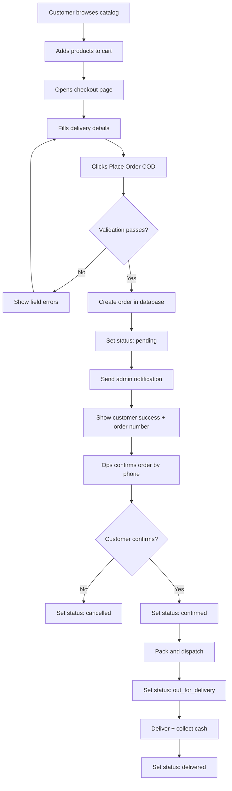
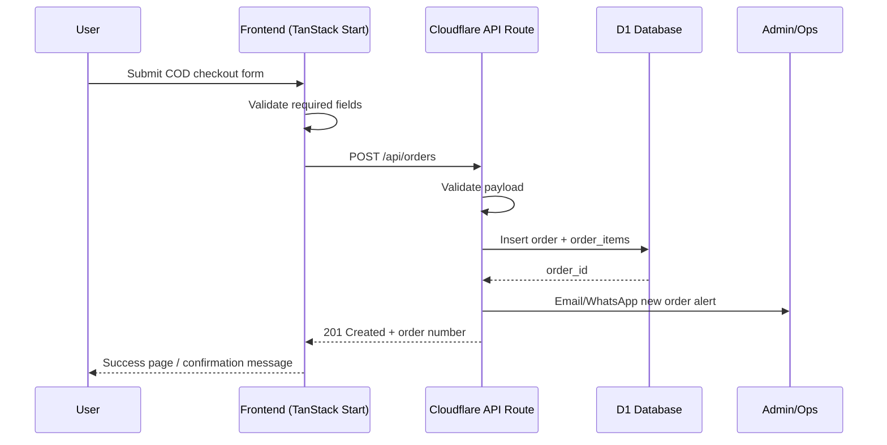
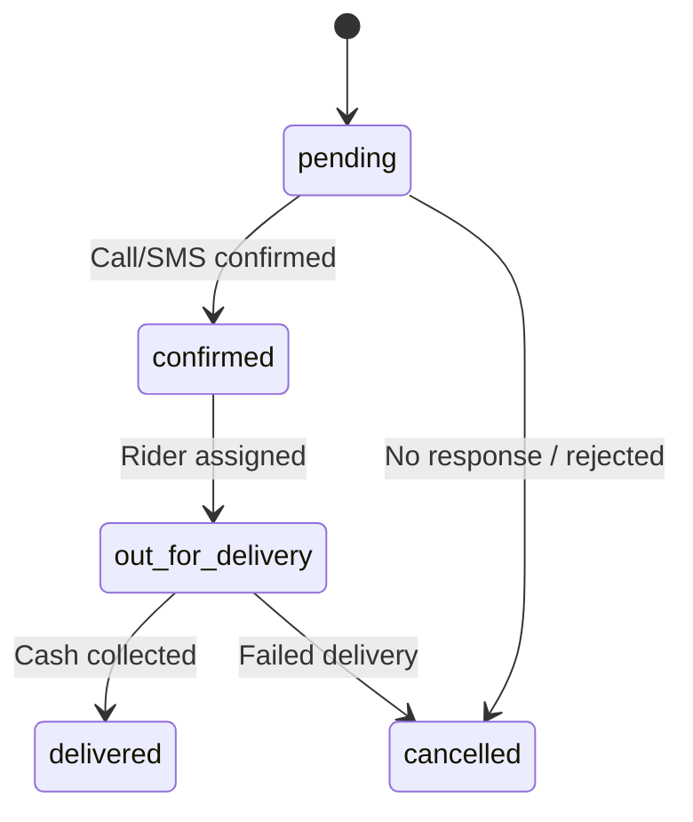

# COD Order Flow (Uganda Furniture E-Commerce)

This document defines the end-to-end process for direct order placement with **Cash on Delivery (COD)**.

## 1. High-Level Customer + System Flow

## 2. Checkout Data Flow (Technical)

## 3. Required Checkout Fields

- Full name
- Phone number (Uganda format)
- Email (optional but recommended)
- District / area
- Exact delivery address + landmark
- Notes (optional)
- Cart items (slug, quantity, price snapshot)

## 4. Order Status Lifecycle

## 5. Admin Operations Flow

1. New order notification received.
2. Call customer to verify location and availability.
3. Update status to `confirmed`.
4. Prepare and dispatch order.
5. Update status to `out_for_delivery`.
6. After payment, update to `delivered`.
7. If failed/rejected, set `cancelled` with reason.

## 6. MVP Guardrails for COD

- Add basic anti-fraud checks (duplicate phone + repeated failed orders).
- Require phone confirmation before dispatch.
- Store a price snapshot per item at order time.
- Keep inventory soft-check to avoid overselling.

## 7. Suggested API Endpoints

- `POST /api/orders` - create COD order
- `GET /api/orders/:id` - customer/admin order lookup
- `PATCH /api/orders/:id/status` - admin status update
- `GET /api/admin/orders?status=pending` - admin queue

## 8. Suggested Minimal Tables

- `orders`
  - id, order_number, customer_name, phone, email, district, address, notes, payment_method, status, subtotal_ugx, delivery_fee_ugx, total_ugx, created_at
- `order_items`
  - id, order_id, product_slug, product_name, unit_price_ugx, quantity, line_total_ugx
- `order_status_history`
  - id, order_id, old_status, new_status, changed_by, changed_at, reason

## 9. Definition of Done (MVP)

- Customer can place COD order end-to-end.
- Order is persisted in DB.
- Admin is notified instantly.
- Admin can update statuses through delivery completion.
- Customer receives order reference number.
